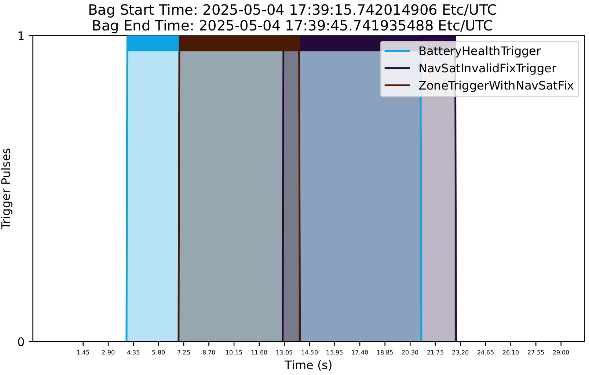
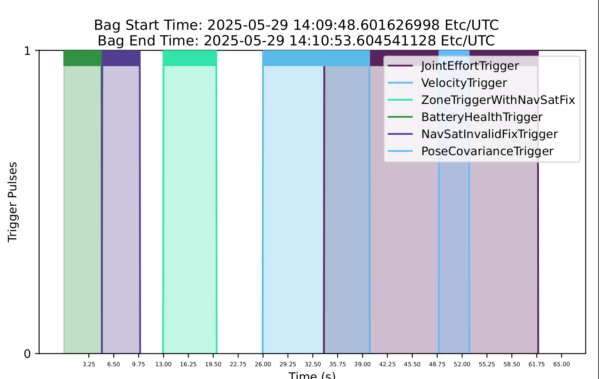
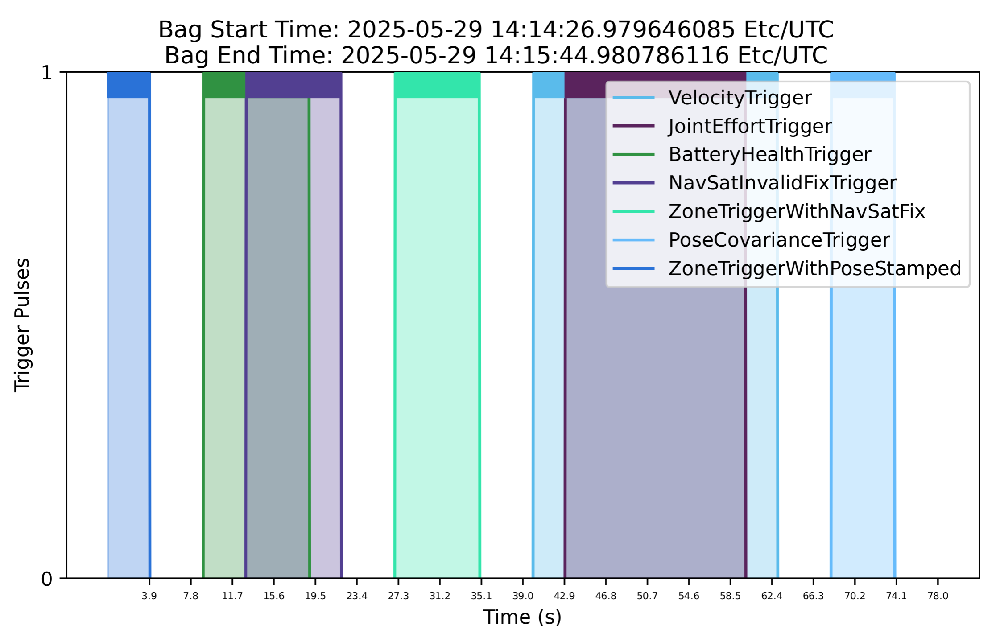
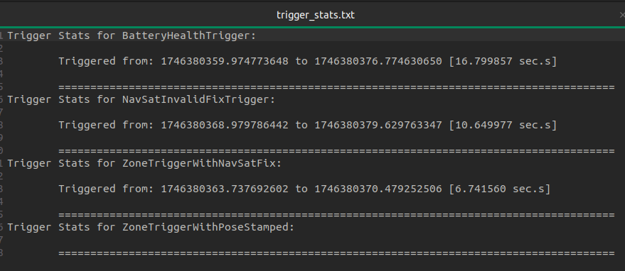
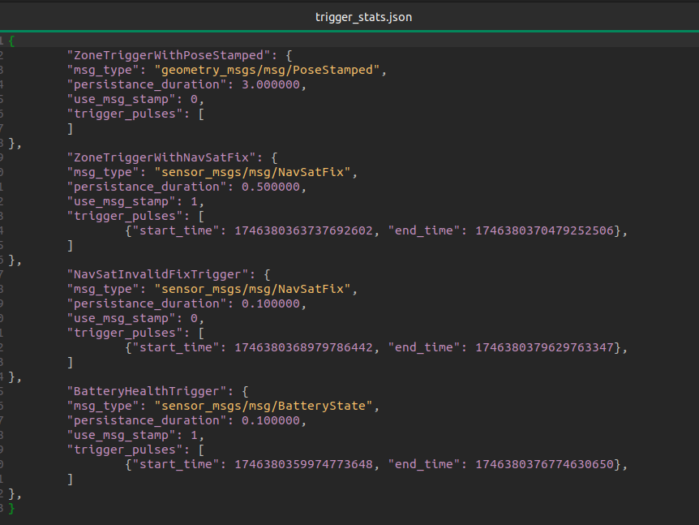

# ros2bag_triggered
[](https://opensource.org/licenses/Apache-2.0)
[](https://github.com/saadehmd/ros2bag_triggered/actions/workflows/cmake-single-platform.yml) 

A collection of helper classes for rosbag2 focused mainly at providing triggering functionality with ros2 bags.

## Brief Introduction:  
This package is aimed at extending the functionality provided by [rosbag2_snapshot](https://github.com/gaia-platform/rosbag2_snapshot). The idea of keeping a small data-buffer of recorded data and being able to trigger, when to save this buffered  bag (instead of an eternally running rosbag recorder) is insanely helpful in a lot of production environments where even minutes worth recorded rosbags can turn into gigabytes of data or when routine clean-ups of disk-space are not practical. 

Yet, even with a handy tool like rosbag_snapshot, users ought to handle the triggering logic themselves. Writing it either as separate client nodes, monitoring data on rostopics-of-interest or as extra logic within their own nodes publishing those topics.
This can easily get out-of-hands, in an environment where you can have tens of rostopics-of-interests (whether being recorded or simply acting as mere triggers for saving the recording.). Besides triggering, one might also want to analyse why a certain bag was triggered and what kind of triggers have been produced over previous N recording sessions. 

## Objectives:
Solving the above problems partially or entirely is the main motivation behind this project. 

The core idea is to provide a convinient way to :-

- Write triggering logic isolated from the recording or publishing node.
- Organize triggering logic into individual modules with a uniform base-interface.
- Fine-tune how triggers crop, delete or copy the recorded bag using a quickly-configurable YAML interface.
- Re-configure trigger-logic-specific parameters from YAML rather than recompiling the code.
- Combine multiple triggers into a single module and delegate the tasks of initialization, resetting, and aggregating these triggers to a dedicated recorder node. 
- Plot triggers or collect important statistics on the triggered ros-bags 

## How triggering works:
Every trigger essentially registers a persistant occurance of a triggering condition. The `TriggerRecorderNode` owns and manages these triggers and binds them to the respective topic-subscribers being used to monitor the triggering condition. `TriggerRecorderNode` records a bag for a pre-configured duration and buffers all the triggers in this duration. At the end, this bag is marked as "Triggered" and moved to user-configured directory for stashing all the triggered bags. The `TriggerRecorderNode` then resets all the triggers and opens a new bag for recording.

## Bag-cropping:
The users also have option to crop only the interesting(triggered) duration from the whole bag. This cropped section of the bag is from ```start_time``` of the earliest occuring trigger to the ```end_time``` of latest occuring trigger. Users can also add a sort of padding or gap on each end of crop point. This is useful because, the events leading upto the point of a trigger situation might be equally interesting as the triggering situation itself. This is configured by the ```crop_gap``` parameter explained in following sections.

## Useage:
Working with ros2bag_triggered follows a simple paradigm:-
1. You implement your "triggering-logic" to a custom `TriggerType` inheriting the interface from `TriggerBase` class.  
2. You write some basic configuration for each trigger into a single `config.yaml`
3. You hand over your custom TriggerTypes to the templated `TriggeredRecorderNode<std::variant<YourTriggerTypes>>` class. This class safely initializes your custom trigger types based on the `config.yaml` file and manages their lifecycle within the recorder.
4. You use this `TriggeredRecorderNode<std::variant<TriggerTypes>` class instance anywhere inside your code, with either single-executor, multi-executor or composable-nodes setup.
5. You can have some `TriggerType`s that are compiled within `TriggeredRecorderNode<std::variant<TriggerTypes>` as a template arg but still left-out from the `topic_config.yaml`. These would simply be disabled triggers in the node. But you cannot do the opposite i.e.; If a `TriggerType` config is in the `topic_config.yaml`, it should not be missing from the template args, otherwise you'll get runtime error.

### Implementing & Configuring Custom TriggerTypes:
Refer to : [examples](ros2bag_triggered_examples/)

### Configuring TriggeredRecorderNode Params:
```yaml

The TriggeredRecorderNode takes path to the config folder as input and expects both 'topic_config.yaml' and 'writer_config.yaml' in the provided config folder.

The following gives an example for the 'writer_config.yaml':-

bag_root_dir: "./ros2bag_triggered/bags"    # The directory where the bag files will be stored. The bag name would be inferred as 
                                            # Unix timestamp. Change this root dir accordingly.

max_bagfile_size: 1000000000                # The maximum size a bagfile can be, in bytes, before it is split.
                                            # A value of 0 indicates that bagfile splitting will not be used.

max_bagfile_duration: 300                   # The maximum duration a bagfile can be, in seconds, before it is split.
                                            # A value of 0 indicates that bagfile splitting will not be used.

max_cache_size: 0                           # Bytes. A value of 0 disables caching and every write happens directly to disk.

trigger_buffer_interval: 600.0              # The interval in seconds for which the triggers are buffered before being checked.
                                            # Once this interval is over, the triggers are checked and reset, the bagfile along with
                                            # a trigger report and plot is saved if any trigger was active otherwise removed and a 
                                            # new bagfile is opened for writing. 
                                            # NOTE!! This is different than the above "bag-splitting" feature, which is rosbag2's 
                                            # inherent feature for splitting a single ros2bag into multiple .db files while the 
                                            # bag-folder and metadata remain similar for the whole bag. This param actually closes 
                                            # the last buffered bag and opens a new one.

bag_cropping: True                          # Enable/disable bag cropping. If enabled, the bag is rewritten from first to last
                                            # trigger stamp. i.e.; From start-time of the first trigger to the end-time of the last.
                                            # If disabled, the whole bag is kept (and not rewritten) if triggered.

crop_gap: 10.0                              # The gap (padding) in seconds to add before and after the crop-points of the bag.If this
                                            # padding results in cropping points outside the recorded bag duration, the crop-points 
                                            # are simply clamped upto actual bag-start or bag-end time.

write_trigger_stats: true                   # If true, the trigger stats and plot will be written to the bag directory. 
```

### Using TriggeredRecordNode with the custom TriggerTypes
Refer to a simple triggered_recorder_node [example](./ros2bag_triggered_examples/src/main.cpp) using [custom](./ros2bag_triggered_examples/include/ros2bag_triggered_examples/) TriggerTypes:-
- [BatteryHealthTrigger](./ros2bag_triggered_examples/src/battery_health_trigger.cpp) 
- [NavSatInvalidFixTrigger](./ros2bag_triggered_examples/src/navsat_invalid_fix_trigger.cpp) 
- [ZoneTriggerWithNavSatFix](./ros2bag_triggered_examples/src/zone_trigger_with_navsat_fix.cpp) 
- [ZoneTriggerWithPoseStamped](./ros2bag_triggered_examples/src/zone_trigger_with_pose_stamped.cpp) 
- [VelocityTrigger](./ros2bag_triggered_examples/src/velocity_trigger.cpp)
- [JointEffortTrigger](./ros2bag_triggered_examples/src/joint_effort_trigger.cpp)
- [PoseCovarianceTrigger](./ros2bag_triggered_examples/src/pose_covariance_trigger.cpp)

### Build & Run the example TriggeredRecordNode:
There're few important dependencies required to build this `ros2bag_triggered` package:-
- python==2.7 or python>=3.6 recommended
- matplotlib-python
- numpy-python
- matplotlibcpp

As per the recommendation from [Matplotlibcpp](https://github.com/lava/matplotlib-cpp) install python dependencies as follows:-
```bash
sudo apt-get install python3-matplotlib python3-numpy 
``` 
or
```bash
pip install matplotlib numpy
```

Once you have above python dependencies, clone the [Matplotlibcpp](https://github.com/lava/matplotlib-cpp) repo, build and install it:-
```bash
git clone https://github.com/lava/matplotlib-cpp
cd matplotlib-cpp && mkdir build && cd build
cmake .. && cmake --build .
cmake --install .
```

Some useful [resources](https://matplotlib-cpp.readthedocs.io/en/latest/examples.html) on matplotlibcpp useage, installation or compilation issues.

```bash
# Navigate to your ros2_ws/src dir, clone this repo and build the packages in this project from ros2_ws/ with :-
colcon build --symlink-install --packages-select ros2bag_triggered ros2bag_triggered_examples ros2bag_triggered_tester

# Run the example node
ros2 run ros2bag_triggered example_node
```
Run the `trigger_tester` utility from [ros2bag_triggered_test](./ros2bag_triggered_tester).
Play around a bit with the triggers in the trigger_tester GUI and then shut down the the `example_node`. 
Navigate to the path configured in [example writer_config](./ros2bag_triggered_examples/config/writer_config.yaml) under `bag_root_dir` field. You should have `triggered_bags` folder and your last recorded bag there. 

Check the metadata.yaml and see if the bag has the full recorded duration or cropped duration. Also, check if the msg counts seem right on the topics that were configured to be recorded in [example topic_config](./ros2bag_triggered_examples/config/topic_config.yaml)

### Trigger stats and plots: 
If you have enabled ```write_trigger_stats``` option, the writer will output a bunch of analytical reports for you from the triggers that occured during each bag and save those in the bag folder itself. You should have following in the bag folder if it was triggered:-
1. ```metadata.yaml```
2. N number of bag files 
3. ```trigger_stats.txt```  (This is a human-readable report of trigger pulses and their durations for a quick scan).
4. ```trigger_plot.pdf```   (This is a visual report of trigger pulses).
5. ```trigger_stats.json``` (This is a record of triggers readable by some python script, useful for your own plotting/analysis).

#### Example Trigger Stats Plot:




#### Example trigger_stats.txt:


#### Example trigger_stats.json:



### ToDo:
- Support registering a single trigger type to multiple topics.
- Provide a self-unlatch configuration for triggers.
- Benchmark bag-cropping/rewrite for huge bagfiles. Move to a separate thread if it creates a bottleneck for bag switch-over.