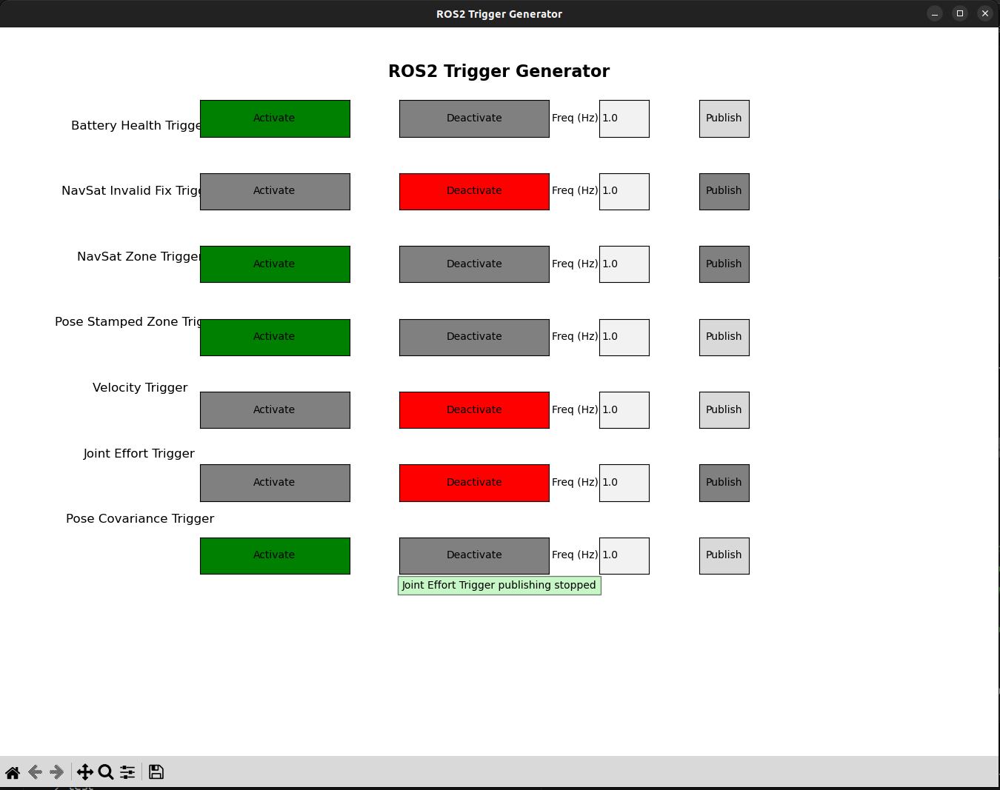

# Testing Utility for ros2bag_triggered

In order to get an intuitive sense of what the triggers are, how are they captured by the `TriggeredRecorderNode` and how do the output stats and plot represent these triggers, we can use this simple testing utility. Which is basically just a matplotlib GUI with some buttons to publish some ROS2 msgs. The so-called `DummyTrigger`s in this package publish  triggers from [examples](../ros2bag_triggered_examples/) package as either `activated` or `deactivated`.

Make sure you have gone through the sections **Writing Your Custom TriggerType** and **Configuring Triggers** in these [examples](../ros2bag_triggered_examples/), to be able to configure these `DummyTrigger`s. The main file to focus on is [trigger_test.py](./ros2bag_triggered_tester/trigger_tester.py). This file by default has the necessary configuration to activate/deactivate the triggers as-per the configuration in [examples/topic_config](../ros2bag_triggered_examples/config/topic_config.yaml), so there's no need to change anything unless you modify the activation/deactivation parameters i.e.; topic_names or conditional_params in [examples/topic_config](../ros2bag_triggered_examples/config/topic_config.yaml).

Run the following to initialize the dummy_trigger_publisher_node:-
```bash
ros2 run ros2bag_triggered_tester tigger_tester 

# Note: If running this from inside a Docker container, ensure GUI access is enabled.
# You can enable GUI access by using X11-forwarding:
# Refer: https://medium.com/@priyamsanodiya340/running-gui-applications-in-docker-containers-a-step-by-step-guide-335b54472e4b
```

You'll have the following GUI pop-up immediately, which is a ROS2 node publishing all the `DummyTrigger`s. Use the `Activate` and `Deactivate` buttons to activate/deactivate a trigger's activation logic. These only change what msg would be published on this dummy trigger topics. You then have to also toggle the `Publish` button to start/stop publishing. You can also change the publish frequency.


